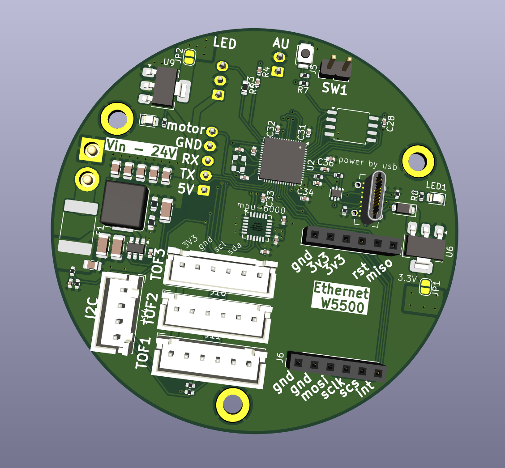
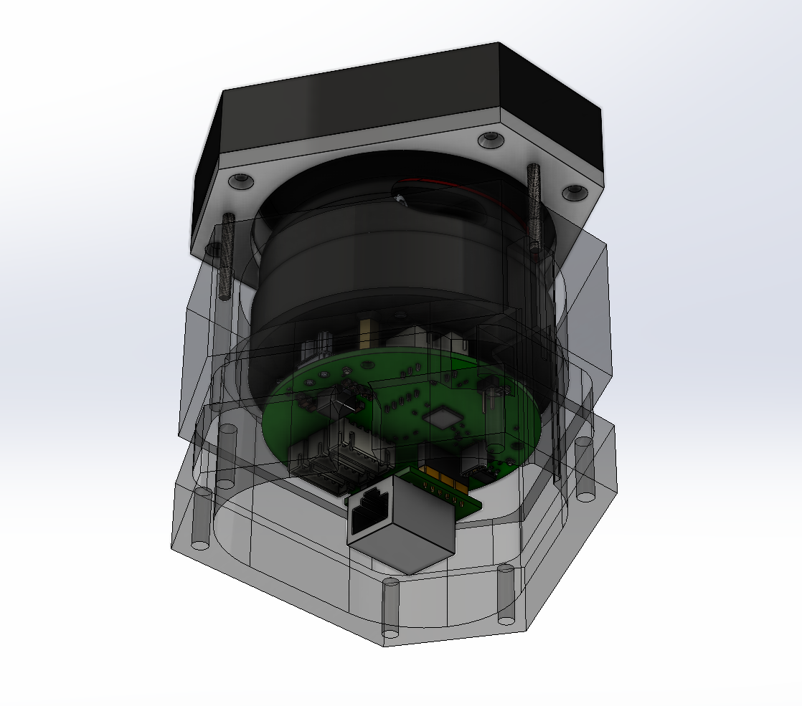

# Carte lidar - opossum 2025

Cette carte se trouve dans le mat de balise du robot opossum.
Elle doit : 
- Gérer le lidar A2M12 (alimentation + récupération des données).
- Gérer un accéléromètre mpu-6000 et l'utiliser pour corriger les points lidar.
- Gérer le ruban led qui entoure le mat de balise
La communication avec le raspberry pi se fait soit par USB (également utilisé pour programmer le rp2040) soit via ethernet avec un module W5500.

On peut également y brancher 3 TOFs de type vl53l0x et une carte d'extension i2c pour en brancher plus. 

L'alimentation du rp2040 se fait au choix soit par la tension d'entrée 24v également utilisée par le lidar, soit par l'usb.

## Intégration mécanique dans le robot 
Voici un appercu de la carte dans le mat de balise du robot :
 
